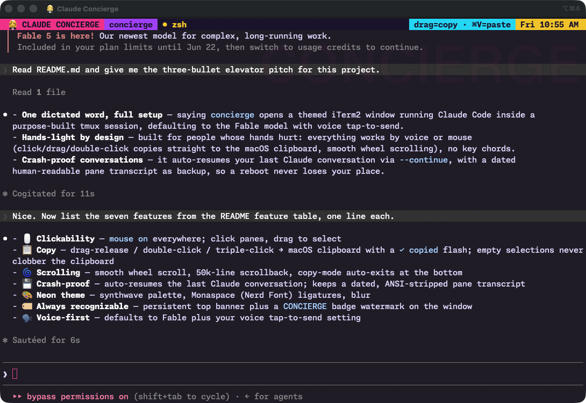

# 🤵‍♀️ Claude Concierge

A one-word command that opens a **dedicated, beautiful terminal window** running
[Claude Code](https://claude.com/claude-code) — tuned for a hands-light,
dictation-first workflow.

```sh
concierge
```

That single command pops a neon iTerm2 window running Claude Code inside a
purpose-built tmux session: click-to-select, drag-to-copy straight to the macOS
clipboard, buttery mouse-wheel scrolling, a persistent **CONCIERGE** banner so
you always know which window you're in — and it **auto-resumes your last
conversation**, so a crash or reboot picks up exactly where you left off.

<p align="center">
  
</p>

> Built for working by voice. Defaults to the **Fable** model and honors your
> Claude Code voice tap-to-send setting.

---

## Why

If your hands hurt, the mouse and keyboard are the enemy. The Concierge leans on
the things that *don't* hurt:

- **Talk, don't type.** Launches with the Fable model and voice tap-to-send.
- **One word to start.** `concierge` — easy to dictate, easy to remember.
- **Click anything, it copies.** Drag-select, double-click a word, triple-click
  a line → it's on your clipboard. No key chords.
- **Never lose your place.** Every conversation is durably persisted; the window
  resumes it automatically.

## Features

| | |
|---|---|
| 🖱️ **Clickability** | `mouse on` everywhere — click panes, drag to select |
| 📋 **Copy** | Drag-release / double-click / triple-click → macOS clipboard, with a `✓ copied` flash. Empty selections never clobber the clipboard. |
| 🌀 **Scrolling** | Smooth wheel scroll, 50k-line scrollback, copy-mode auto-exits at the bottom |
| 💾 **Crash-proof** | Auto-resumes the last Claude conversation; also keeps a dated, ANSI-stripped pane transcript |
| 🎨 **Neon theme** | Synthwave palette, Monaspace (Nerd Font) ligatures, blur |
| 🏷️ **Always recognizable** | Persistent top banner + a `CONCIERGE` badge watermark on the window, showing the installed Concierge + Claude Code versions |
| 🗣️ **Voice-first** | Defaults to Fable + your voice tap-to-send setting |
| 🔌 **One socket for everything** | New tmux sessions from other tools default onto the Concierge socket, so `Ctrl-b + s` / `j`/`k` shows all of it — see [`docs/configuration.md`](docs/configuration.md) |
| 🕐 **Timestamps** | Every Claude response is stamped with its arrival time (Claude Code's native `showMessageTimestamps`, ensured at launch) |

## Requirements

- macOS + [iTerm2](https://iterm2.com)
- [Claude Code](https://claude.com/claude-code) (`claude` on your `PATH`)
- `tmux` 3.x (`brew install tmux`)
- [Homebrew](https://brew.sh) (optional — used to install the font)

## Install

```sh
git clone https://github.com/tbaums/claude-concierge.git
cd claude-concierge
bash install.sh
```

This installs the config to `~/.config/claude-concierge`, the launcher to
`~/.local/bin/concierge`, the Monaspace Nerd Font (via Homebrew, if missing),
and the iTerm2 dynamic profile. It's idempotent — re-run to update.

Then just:

```sh
concierge
```

## Usage

```sh
concierge          # open a new themed iTerm window, resuming your last chat
concierge --new    # start a brand-new conversation instead of resuming
concierge --here   # run in the current terminal (no new window / no theming)
```

## How resume works

Claude Code already writes a complete, structured transcript of every message
and tool call to `~/.claude/projects/<cwd>/*.jsonl` as it happens. The Concierge
simply launches with `--continue`, so that transcript *is* your durable state —
no extra logging overhead, no quality degradation over time. A second,
human-readable pane log (ANSI-stripped, dated, auto-pruned after 60 days) is
kept under `~/.claude/concierge-logs/` for any non-Claude shell output.

See [`docs/`](docs/) for configuration, theming, and troubleshooting. The
mouse/copy/scroll behavior is lifted from a battle-tested workshop container
config.

## Tests

Pure local, no CI:

```sh
bash test/run.sh
```

## License

[MIT](LICENSE) © 2026 Jamie Tanenbaum
